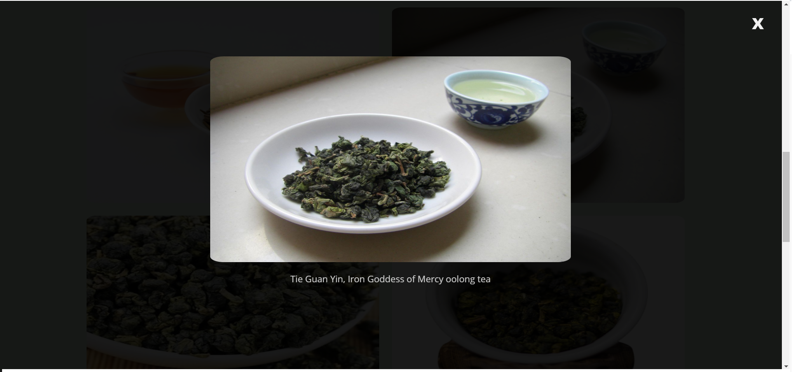
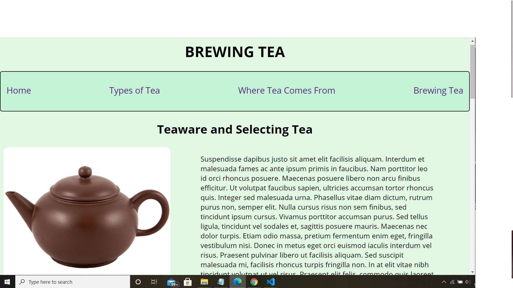

This project is an informational website on tea, containing a homepage/introduction page, an interactive gallery that contains pictures of different varieties of tea, and two pages that are primarily content with some images of tea. 
The gallery (types of tea) incorperates JavaScript. Try clicking on one of the images. 
The site contains breakpoints making it responsive and viewable on multiple types of devices. 
Lorem ipsum (a dummy text) was used so the site's layout is functional, but the content isn't about tea, since the goal of the project was to make a working project and not worry about content. 